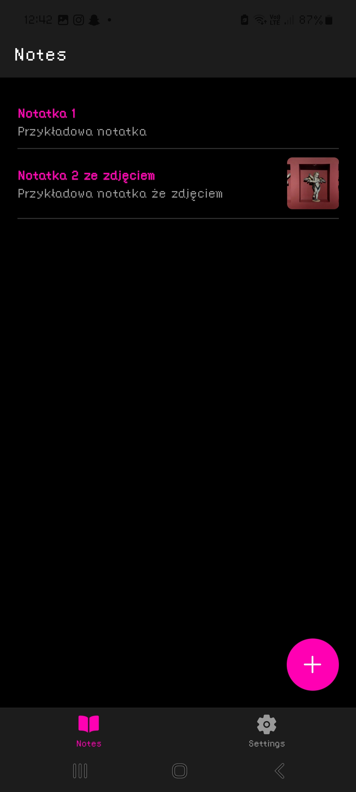
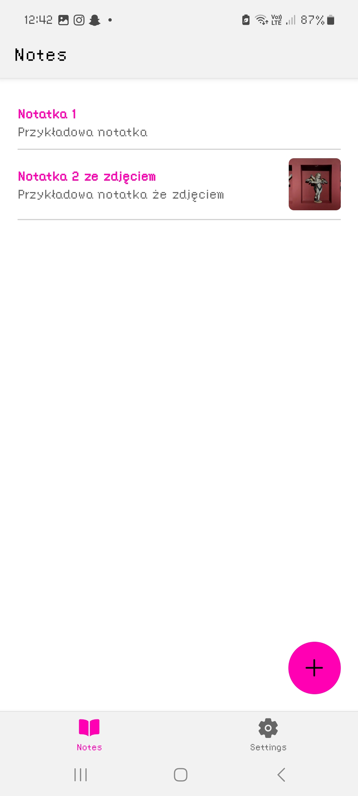
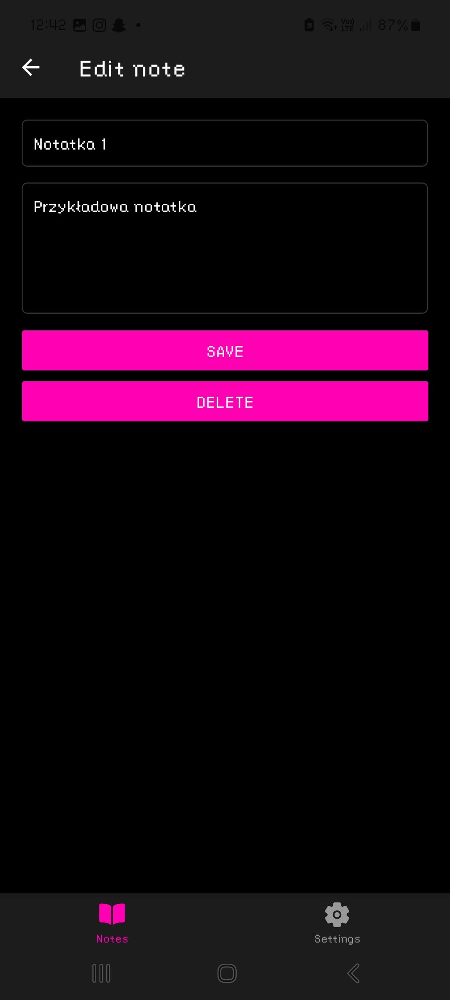
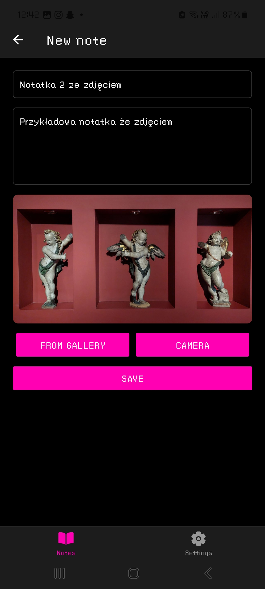
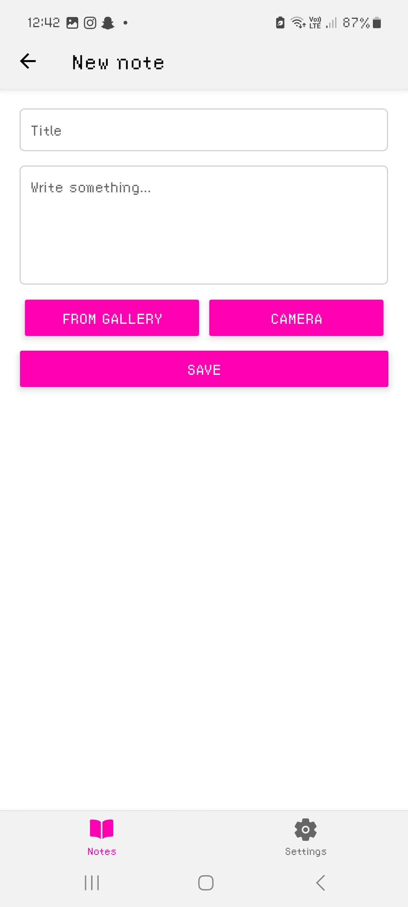
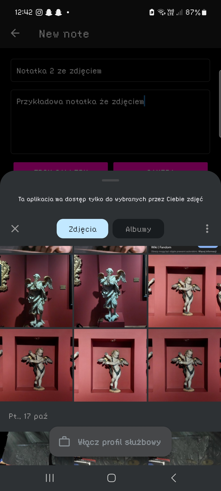
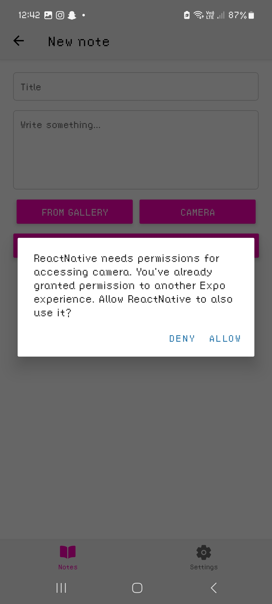
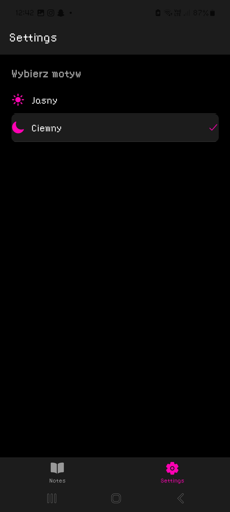
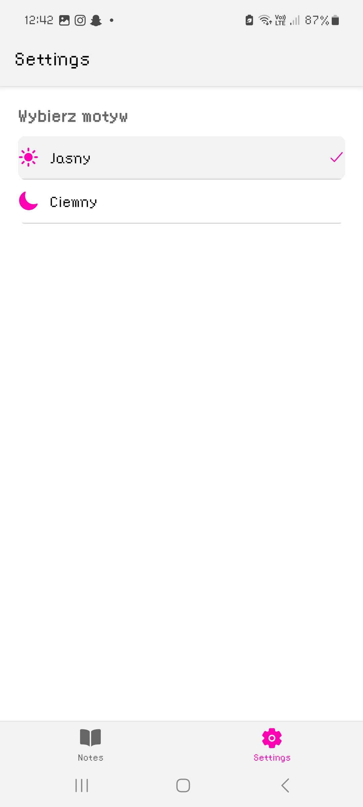

# 📒 React Native Notes App

A simple application built with **React Native** and **Expo**.  

## ✨ Features

- Create, edit, and delete notes
- Storage using **AsyncStorage**
- Themes (light, dark)
- Add photos to notes (camera or gallery via `expo-image-picker`)
- Thumbnail preview in notes list
- Full image view in note details
- Navigation with **React Navigation** (stack + bottom tabs)

## 🛠️ Installation

1. Clone the repository:
   ```bash
   git clone https://github.com/your-username/react-native-notes-app.git
   cd react-native-notes-app
2. Install dependencies:
   ```bash
   npm install
4. Install required Expo packages:
   ```bash
   npx expo install @react-native-async-storage/async-storage expo-image-picker react-native-safe-area-context react-native-screens @react-navigation/native @react-navigation/native-stack @react-navigation/bottom-tabs
6. Start the project:
   ```bash
   npx expo start

## 📸 Usage

Tap ➕ to create a new note.
Add a title, text, and optionally attach a photo.
Notes are saved automatically in **AsyncStorage**.
Tap a note to view details, edit, or delete it.
Switch themes in Settings.

## 📸 Screenshots

### Notes list

Shows all saved notes with title, preview text, and image thumbnail.



Light Theme.



### Notes details

Displays the full note content along with the attached photo in large view.



### Notes form

Form to create a new note with title, text, and option to add a photo from camera or gallery.





### Adding photo

Screen of adding the photo from gallery



Displays message asking to allow access to phone camera (Light theme).



### Settings

Displays the settings page with the ability to change themes form light to dark.






